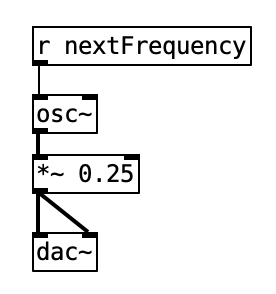

# react-native-pure-data

## TODO: Fix /src to /dist @ package.json

<p align="center">
  
</p>


A native wrapper for [`libpd-ios`](https://github.com/libpd/pd-for-ios) and [`libpd-android`](https://github.com/libpd/pd-for-android), which enables you to rapidly prototype [**DSP**](https://en.wikipedia.org/wiki/Digital_signal_processing) algorithms described using [**Pure Data**](https://puredata.info/), an industry standard open source visual programming language capable of synthesising audiovisual effects.

[`react-native-pure-data`](https://github.com/cawfree/react-native-pure-data) enables the synthesis of generative audio, which helps developers achieve dynamic sound at runtime. This is useful for games, music production and [communications](https://github.com/cawfree/OpenChirp).

### Key Features

  - [**Patches**](https://puredata.info/community/member-downloads/patches) in Pure Data can be interacted with via [**React**]() component props.
  - Simultaneous patch execution.
  - Supports [**hot reloading**](https://reactnative.dev/blog/2016/03/24/introducing-hot-reloading.html), so DSP algorithms can be prototyped directly using Pure Data's interface and then executed concurrently on an Android/iOS device or emulator.
  - Loaded patches respect the [**Component Lifecycle**](https://reactjs.org/docs/state-and-lifecycle.html), so they can be mounted or unmounted as expected.

## ⚠️ Warning

**Please be extremely cautious when prototyping using this library.**

Pd is capable of generating high amplitude sound waves, which can [**damage your hearing if you choose to listen using headphones**](https://www.reddit.com/r/puredata/comments/gc06aa/is_it_true_that_using_pure_data_with_earphones_is/).

Please take care to minimize the risk of hearing damage or loss as much as possible by playing back on external speakers at a reduced volume whenever prototyping with new patches or props. In addition, you must **always** consider the volume of the end user's device.

And remember,

> With great power, comes great responsibility.
> [- Linus Torvalds](https://en.wikipedia.org/wiki/Linus_Torvalds)

## 🚀 Getting Started

### 1. Installing

Using [`npm`](https://www.npmjs.com/):

```bash
npm install --save react-native-pure-data
```

Using [`yarn`](https://classic.yarnpkg.com/en/):

```bash
yarn add react-native-pure-data
```

For versions of [**React Native**](https://reactnative.dev/) less than [**0.60**](https://reactnative.dev/blog/2019/07/03/version-60), after installation has complete you must execute `react-native link` to make the native library dependencies visible to your compiled application.

### 2. Update `metro.config.js`

Once installed, you'll [need to](https://github.com/facebook/metro/issues/367) update your [`metro.config.js`](./example/metro.config.js) to help the [**Metro Bundler**](https://github.com/facebook/metro) load your patches:

```diff
+const metroDefault = require('metro-config/src/defaults/defaults.js');

 module.exports = {
   resolver: {
+    assetExts: metroDefault.assetExts.concat(['pd']),
   },
 };
```

This will enable **hot loading**, so you can modify your patches even whilst they're being rendered by the app.

After making this change, you'll need to **restart the bundler.**

### 3. Runtime Specific

#### 3.1 iOS

After installing this library, you'll need reinstall the iOS cocoapods. First, enter your app's `/ios` directory. Then use:

```bash
pod install # update cocoapods
cd ..
react-native run-ios
```

#### 3.2 Android

[**Blocked.**](https://github.com/libpd/pd-for-android/issues/104)

Please ensure that the `minSdkVersion` of your project is `17`:

**android/app/build.gradle**

```diff
- minSdkVersion = 16
+ minSdkVersion = 17
```
After this, make sure you've [**installed the `Android NDK (Side-by-side)`**](https://developer.android.com/studio/projects/install-ndk) to [**Android Studio**](https://developer.android.com/studio). Finally, reinstall your application using `react-native run-android`.

## ✍️ Example

[`react-native-pure-data`](https://github.com/cawfree/react-native-pure-data) exposes just two [**Component**](https://reactjs.org/docs/react-component.html)s; `AudioController` and `Patch`. The former is used for general sound output configuration, and the latter is used to load and interact with a patch written in Pure Data.

The simplest example is a patch which does not rely on any data from your `App.js`; you'll see here, that all we need to do is define an `<AudioController />` at the root of the application, and declare the `Patch`'s file source.

```javascript
import React from "react";
import {AudioController, Patch} from "react-native-pure-data";

import SomePatch from "./patches/some-patch.pd";

export default () => (
  <AudioController
    active
  >
    <Patch
      source={SomePatch}
    />
  </AudioController>
);
```

However, Pure Data is uses an asynchronous, [**message-driven**](https://en.wikipedia.org/wiki/Flow-based_programming) protocol. This normally means that imported patches will need to be either triggered or configured by your runtime logic.

To communicate with a loaded patch from your app, all you have to do is specify additional props on the `Patch` component. These will be synchronously routed to corresponding receivers in the Pure Data patch whenever the component is re-rendered:

```javascript
import React, {useState, useEffect} from "react";
import {AudioController, Patch} from "react-native-pure-data";

import SomePatch from "./patches/some-patch.pd";

export default () => {
  const [frequency, setFrequency] = useState(440);
  useEffect(
    () => {
      /* every 1000ms, set a new frequency */
      const i = setInterval(
        () => setFrequency(Math.random() * 1000),
        1000,
      );
      return () => clearInterval(i);
    },
    [],
  );
  return (
    <AudioController
      active
    >
      <Patch
        source={SomePatch}
        nextFrequency={frequency}
      />
    </AudioController>
  );
};
```

In the example above, a random frequency will be calculated and transmitted to the corresponding receiver on the diagram. In this case, the receiver would be called "nextFrequency", which would be declared using a Pure Data [**Object**](https://puredata.info/docs/ListOfPdExternals) with the definition `[r nextFrequency]`:

<p align="center">
  
</p>

The convention used here is that for every numeric prop, the name of that prop corresponds to the message receiver within the patch.

Therefore, if we defined an additional prop named `someOtherFrequency={Math.random()}`, whenever the component is re-rendered we would send a message to the receiver `[r someOtherFrequency]` that existed within the patch. If the receiver does not exist, this is a [**noop**](https://en.wikipedia.org/wiki/NOP_(code)).

Please check out the [**Example App**](https://github.com/cawfree/react-native-pure-data/tree/master/example) for further details.

## ✨ Resources 

  - [**Awesome Pure Data**](https://github.com/virtualtam/awesome-puredata)
  - [**PatchStorage**](https://patchstorage.com)
  - [**PdPatchRepo**](http://pdpatchrepo.info/patches/patch/14)

## ✌️ Licence
[**MIT**](./LICENSE)
